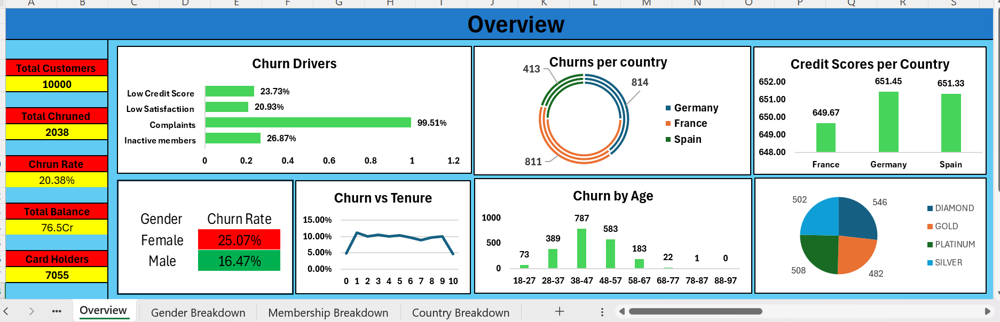
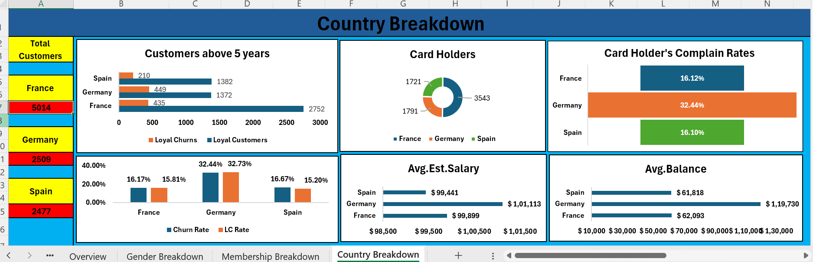
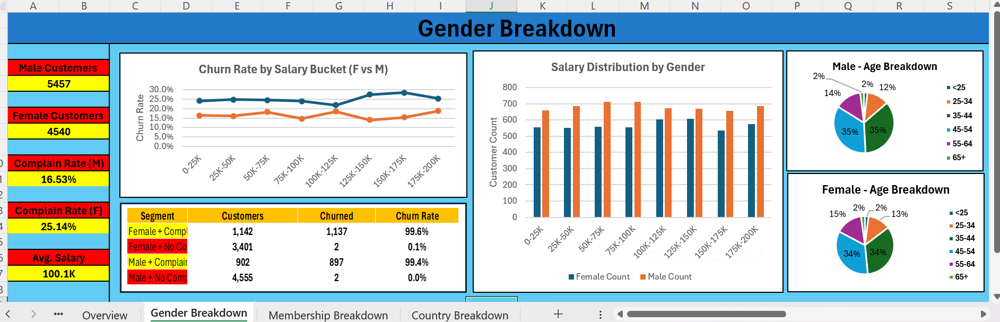
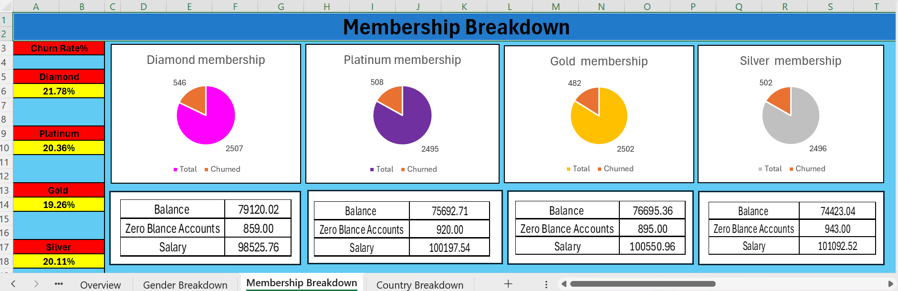

# 🏦 Bank Customer Churn Analysis

> An end-to-end data analysis project investigating customer churn across **10,000 bank customers** using **MySQL** for analysis and **Excel** for interactive visualization.

---

## 📊 Dashboard Preview

### 🔹 Churn Overview


### 🔹 Country Breakdown


### 🔹 Gender Breakdown


### 🔹 Membership Breakdown


---

## 🎯 Project Objective

To identify the key drivers of customer churn in a multinational bank and provide actionable retention recommendations. The analysis segments churn risk across demographics, geography, product holdings, and customer behavior.

---

## 🛠️ Tools & Techniques

| Tool | Purpose |
|------|---------|
| **MySQL 8.0** | Data exploration, segmentation, and statistical analysis |
| **Microsoft Excel** | Interactive dashboard with slicers, pivot tables, and KPI cards |
| **SQL Concepts** | GROUP BY, HAVING, CASE WHEN, Subqueries, Aggregate Functions |

---

## 📈 Key Findings

1. **Germany has the highest churn rate** compared to France and Spain  
2. **Customers with multiple products show higher churn patterns**
3. **Inactive members are more likely to churn**
4. **Age group 46–60 shows the highest churn risk**
5. **Female customers churn slightly more than male customers**
6. **Customer complaints strongly correlate with churn behavior**

---

## 🗂️ Dataset Information

- **Source:** Kaggle — Bank Customer Churn Dataset
- **Rows:** 10,000
- **Columns:** 18
- **Features Included:**
  - Geography
  - Gender
  - Age
  - Credit Score
  - Balance
  - Estimated Salary
  - Number of Products
  - Active Membership
  - Churn Status

---

## 🔍 SQL Analysis Highlights

The SQL analysis answers multiple business questions including:

- Customer distribution analysis
- Churn segmentation
- Geography-based churn comparison
- Product holding analysis
- Activity-based churn patterns
- Age-group churn trends

### 📄 SQL File
- `Analysis/Analysis with mysql`

---

## 📊 Excel Dashboard Features

- KPI Cards
- Pivot Charts
- Interactive Slicers
- Geography Analysis
- Gender Segmentation
- Membership Insights
- Churn Trend Visualization

### 📂 Dashboard File
- `Analysis/Customer_churn_Analysis.xlsx`

---

## 💡 Business Recommendations

1. Build targeted retention strategies for high-risk countries
2. Improve engagement with inactive customers
3. Monitor complaint-based customers proactively
4. Optimize product-selling strategies to reduce churn

---

## 📁 Repository Structure

```text
Bank-Customer-Churn-Analysis/
│
├── Analysis/
│   ├── Analysis with mysql
│   └── Customer_churn_Analysis.xlsx
│
├── Data/
│   └── Customer_churn_Table.csv
│
├── Images/
│   ├── Churn_Overview.png
│   ├── Country_Breakdown.png
│   ├── Gender_Breakdown.png
│   └── Membership_Breakdown.png
│
├── Report/
│   └── Pandiyaraj_C2_project.docx
│
└── README.md
